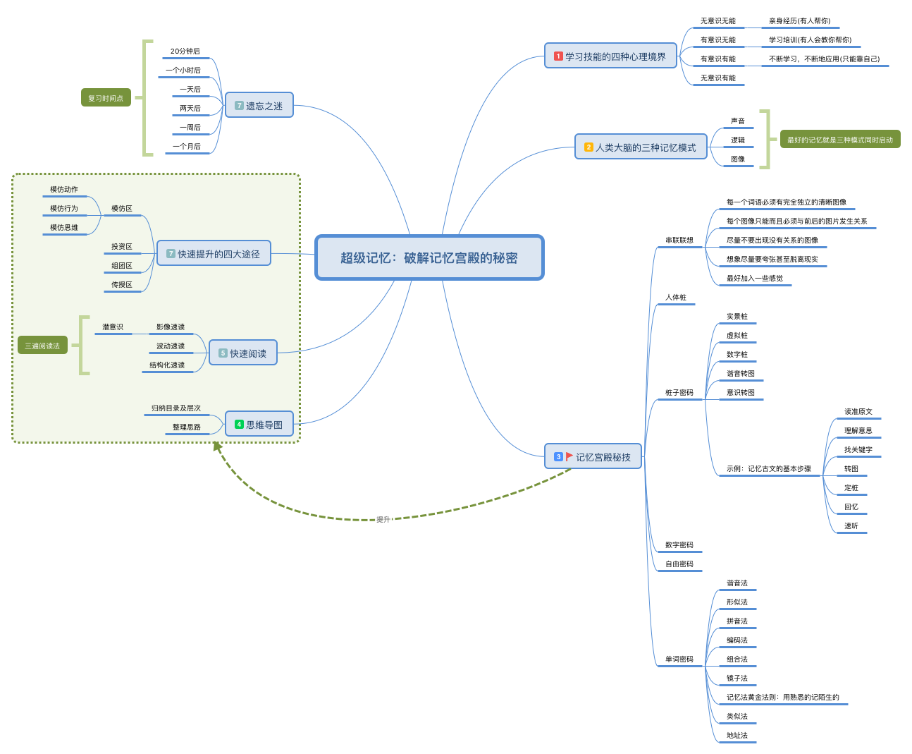

# 超级记忆：破解记忆宫殿的秘密 后记

破解记忆和秘密分别从心理、原理、技法和应用没层面引导如何去快速记忆、利用思维导图去归纳内容、快速阅读的方法及如何高效学习。

本书以少年恩为故事起点用魔幻的思维，严谨的逻辑分别从学习技能的四种心理境界以及人类大脑的三种记忆模式为基础点，围绕各种学习方法进行不同的训练。在密训十天掌握基础方法后，再进去一个提升的过程。通过不段的训练，能达到高效记忆的能力。

